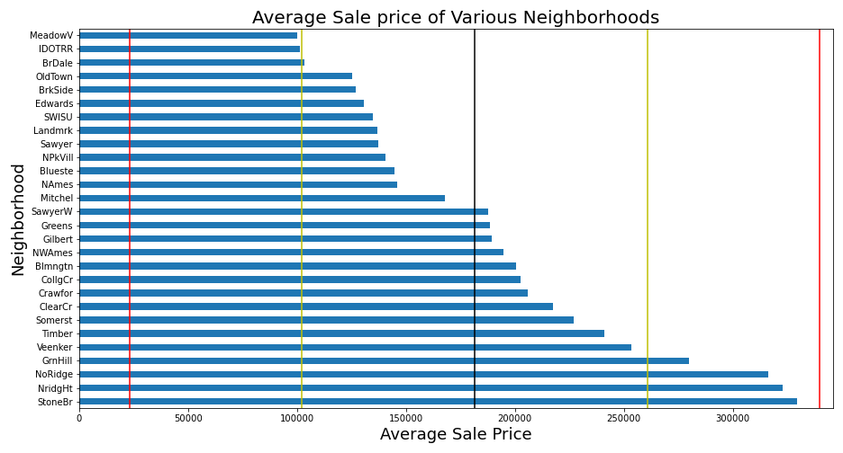

# Housing Regression Multivariate Regression (MLR, Lasso, Ridge)

## Introduction
Housing Regression model built on Ames Housing Data and Kaggle Challenge requirements. 
For this project, 3 types of machine learning models were examined: Multi-parametric Linear Regression, Ridge Regression, and Lasso Regression. Ridge Regression and Lasso Regression are a type of regression that involve scaling and regularization of our data in order by adding an automatically determined level of bias in order to reduce the model complexity and error due to variance. Overall scores for all 3 models fared to be quite similar with R2 scores between 0.84 - 0.86. Since these scores hold true for both testing and train, we can conclude that the model is not overfitting the data. 

## Example Output Images

## Code Execution

### Notebooks
To run code, run '1_eda_data_processing.ipynb' first to export 'train_cleaned.csv' into 'datasets' folder. All images are automatically saved to 'images' folder within this directory. 
Then, run '2_regression_modeling.ipynb' to run modeling code and generate model metrics and images. 

- datasets
    -- train.csv
    -- test.csv
    -- train_cleaned.csv
    -- kaggle_mlr csv files (multiple files for multiple submissions)
- images
    -- images from outputs ending in .png
- 01_housing_regression_eda.ipynb
    -- exploratory data analysis and data processing notebook
- 02_housing_regression_models.ipynb
    -- Regression modeling and model evaluation notebook
    -- discussions/conclusions for project work

## Discussions and Conclusions
The goal of this project was to be able to provide an in-depth look of how certain home features (attributes) lead to increased sales price. We can see that 
In the early data exploration, we were able to notice the connection between sale price and many features that appeal to the common sense of the real-estate industry, such as "Greater Living Area," "Overall Quality","Garage area", "1st floor Square Footage", and the specific neighborhoods that could be important to price in this particular dataset, "ClearCr," "CollgCr", "BrDale","Blueste".

In conclusion we can see how this project was an interesting excerise for data exploration and data science. In the world of real-estate having an accurate model can be a powerful tool to assess (estimate) the potential value of homes, whether it be for the appraisal of a home or for new homes pending to go on the market. This can be a powerful asset for a real-estate team willing to take part in the next generation of technology in the real-estate industry. Companies like Zillow, Redfin, and Rex have transformed the industry by incorporating machine learning models into their approach of the home-buying and home-selling process. 

Future work would involve generalized models to large data sets and to different cities in order to have a "plug and play" solution to any city. Furthermore, we could build a web application that would allow one to find Housing price prediction in their local city and neighborhood given we are able to leverage enough available data and succesfully build models for the given cities. 
